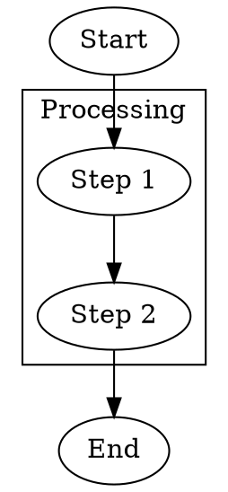

# DOT Cluster and Container Integration

This document describes the enhanced DOT format support with cluster/subgraph integration and container functionality.

## Overview

The graph editor now provides seamless integration between DOT format clusters and the native container system, with proper coordinate scaling and full container behavior support.

## Key Features

### 1. DOT Cluster Support
- **Automatic Recognition**: Subgraphs starting with "cluster" are automatically converted to containers
- **Hierarchy Preservation**: Parent-child relationships are maintained through save/load cycles
- **Visual Integration**: Clusters appear as expandable/collapsible container nodes
- **Position Calculation**: Container positions are automatically calculated as the center of contained nodes

### 2. Coordinate Scaling
- **Grid Alignment**: All coordinates are scaled by 20x during import for proper grid alignment
- **Consistent Export**: Coordinates are scaled down by 20x during export for DOT compatibility
- **Standard Compatibility**: Works with standard Graphviz tools while maintaining internal precision

### 3. Container Behavior Integration
- **Expand/Collapse**: DOT clusters fully support the existing expand/collapse functionality
- **Drag Into Container**: Standard drag-into-container tool works with DOT-imported clusters
- **Nested Edges**: Edges within clusters are properly managed during container operations
- **Visual Feedback**: Container states are preserved and indicated visually

## File Format Examples

### Basic Cluster Structure

### Coordinate Scaling
- **DOT File**: Coordinates like `_x="5"` represent grid units
- **Internal**: Automatically scaled to `x=100` (5 * 20) for precise positioning
- **Export**: Scaled back to `_x="5"` for DOT compatibility

### Container Attributes
- **`_is_expanded="true/false"`**: Controls initial container state
- **`label="Name"`**: Sets container display name
- **`bgcolor="#color"`**: Sets container background color

## Usage Workflow

### Loading DOT Files with Clusters
1. **Open DOT File**: Use File → Open DOT File...
2. **Automatic Processing**: Clusters are automatically converted to containers
3. **Positioned Content**: Contained nodes are positioned within their containers
4. **Ready to Use**: All container functionality (expand/collapse/drag-into) works immediately

### Creating Clusters
1. **Use Container Tools**: Create containers using existing tools
2. **Drag Nodes In**: Use drag-into-container tool to populate
3. **Save as DOT**: Export preserves cluster structure
4. **Standard Compatible**: Generated DOT works with Graphviz tools

### Editing Clusters
1. **Expand Container**: Click expand/collapse button or use expand tool
2. **Edit Contents**: Move, add, or remove nodes within container
3. **Use Nested Edges**: Edges within containers are managed automatically
4. **Collapse When Done**: Container behavior works as expected

## Advanced Features

### Nested Containers
- **Supported**: Containers can contain other containers
- **Proper Nesting**: Subgraph hierarchy is preserved in DOT format
- **Recursive Operations**: Expand/collapse works recursively

### Mixed Content
- **Hybrid Graphs**: Mix DOT clusters with manually created containers
- **Seamless Integration**: All containers behave identically regardless of origin
- **Round-trip Compatibility**: Save/load preserves all relationships

### Layout Integration
- **Layout Algorithms**: All layout algorithms work with containers
- **Preserved Hierarchy**: Container relationships are maintained during layout
- **Cluster-aware**: Layouts can respect container boundaries

## Testing and Validation

### Test Files
- **`cluster_demo.dot`**: Comprehensive example with multiple clusters
- **Demonstrates**: All cluster features, edge types, and container behaviors
- **Validation**: Load, modify, save, and reload to test round-trip compatibility

### Verification Steps
1. **Load cluster_demo.dot**
2. **Verify**: Containers appear with proper hierarchy
3. **Test Expand/Collapse**: Click container controls
4. **Test Drag-Into**: Drag nodes between containers
5. **Save and Reload**: Verify preservation of structure

## Technical Implementation

### Import Process
1. **Parse Subgraphs**: Extract cluster declarations from DOT content
2. **Create Containers**: Generate container nodes for clusters
3. **Position Calculation**: Calculate container center from contained nodes
4. **Set Relationships**: Establish parent-child containment
5. **Scale Coordinates**: Apply 20x scaling for grid alignment

### Export Process
1. **Identify Containers**: Find nodes with container flag
2. **Generate Clusters**: Create DOT subgraph declarations
3. **Export Hierarchy**: Preserve containment relationships
4. **Scale Down**: Apply 1/20x scaling for DOT compatibility
5. **Organize Edges**: Group internal and cross-cluster edges

### Container Integration
- **Native Behavior**: Uses existing container system completely
- **No Special Cases**: Imported clusters behave like native containers
- **Tool Compatibility**: All existing tools work with imported clusters
- **State Management**: Container states are properly maintained

## Compatibility

### DOT Standard
- **Full Compliance**: Generated DOT files work with standard Graphviz
- **Custom Extensions**: Uses `_` prefixed attributes for custom features
- **Graceful Degradation**: Standard tools ignore custom attributes safely

### Editor Features
- **Complete Integration**: All editor features work with DOT clusters
- **No Limitations**: Imported clusters have full functionality
- **Bidirectional**: Edit in editor, export to DOT, reimport seamlessly

This integration provides a professional-grade DOT workflow while maintaining the full power of the native container system.
